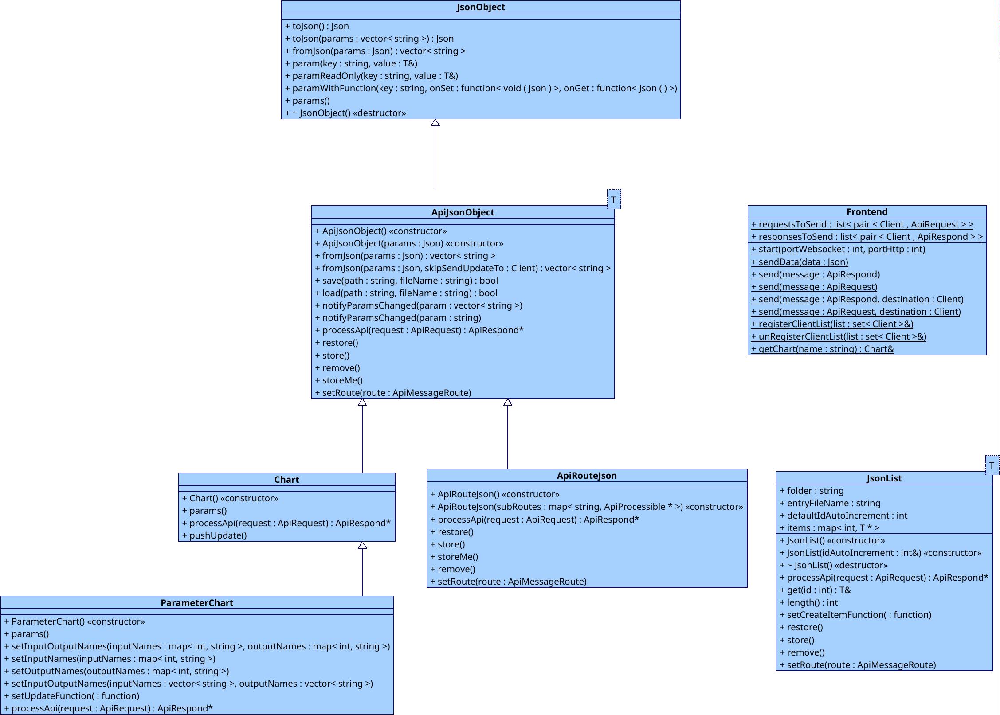

# ♒😺♒ Catflow 
Catflow is a framework for syncing object-tree-structures between a c++ backend and a web-javascript frontend.
 * noSql database like access to objects (path to the object in **api-object-tree**)
 * objects are represented in json format
 * push and react to changed objects
 * access api via webSocket connection from javascript [(protocol doc here)](doc/README.md)
 * **main types** of elements in the object-tree:
    * *ApiJsonObject*: represents a object instance of a class (has properties/members, ...)
    * *ApiList (extends ApiJsonObject)*: list of multiple JsonObjects (add,remove items)
    * *ApiRouteJson (extends ApiJsonObject)*: contains subRoutes: `/my-apiJsonRoute/subRoute1`
 * ApiList and ApiRouteJson can be nested into each other


### C++ Uml of main classes


### Example
Create the following api-tree structure to organize a university:
 * the university consists of multiple courses (has a ApiList as subRoute at `courses/` )
 * each course has a id and courseName, multiple students can be part of that course (has a ApiList as subRoute at `students/` )
 * each students has a id, age and name 

To address student 44 in course 3 you would write: `/courses/5/students/1/`.
The full example code is [here](example).

```bash
/courses -+
          +- courseID[3]/students/ -+
          |                         +- studentID[44]
          |                         +- studentID[34]
          |                         +- studentID[81]
          |
          +- courseID[8]/students/ -+
          |                         +- studentID[44]
          |                         +- studentID[34]
          |                         +- studentID[81]
          +- ...

```
Define this structure in C++:
```c++
/*
 * students in course
 * At: /courses/<courseId>/students/<studentId>/
 */
class Student : public ApiJsonObject
{
  public:
    string name;
    int age;
    int id; // <studentId>

    void params() override {
      param("id", id);
      param("age", age);
      param("name", name);
    }
};

/*
 * UniversityCourse, contains list of students
 * At: /courses/<courseId>/
 */
class UniversityCourse : public ApiRouteJson
{
  public:
    JsonList<Student> students;

    string courseName;
    int id; // <courseId>

    UniversityCourse():
      ApiRouteJson({{"students", &students}}) // mount JsonList<Student> at 'students/'
    {
    }

    void params() override {
      param("courseName", courseName);
      param("id", id);
    }
};


/*
 * Root of api, entry-point
 * contains /courses as subRoute
 * At: /
 */
class RootRoute : public ApiRoute
{
  public:
    JsonList<UniversityCourse> courses;
    
    RootRoute():
      ApiRoute({  // set sub routes
                 {"courses", &courses} // mount JsonList<UniversityCourse> at 'courses/'
               }) 
    {
    }
};
 ```
Now we just need to init catflow and start listen for incoming requests from the frontend:
```c++
int main()
{
    RootRoute rootRoute;
    rootRoute.setStorePath("./"); // store all in this dir
    rootRoute.restore();          // restore object-tree from previous run
    
    Catflow::setRootRoute(rootRoute);
    Catflow::start(
      5555, // webSocket port
      8050  // http port, serve web app
    );

    // start blocking taskManager, use for chart updates
    TaskManager::start();
}

``` 

Now we can use this api from the fronted via typescript/javascript:
```typescript
// connect to c++ backend
ApiConnection.connect('localhost', 5555);
Api api = new Api();


// lets display all courses every time one changes (added, removed)
api.list('/courses').items().subscribe(courseList => {
    console.log('/courses List changed: ', courseList);
})


// now create a new course
api.list('/courses').add(
    {
      name: 'math'
    }
).then(newCourseId => {
    /* callback after course has been added
     * newCourseId is the identifier of math course */
    
    // print updates of students List of this course
    api.list(`/courses/${newCourseId}/students`).items().subscribe(studentsList => {
        console.log(`/courses/${newCourseId}/students List changed: `, studentsList);
    })
    
    // add two students to this course
    api.list(`/courses/${newCourseId}/students`).add( 
        {
          name: 'Lisa',
          age: 22
        }  
    );
    api.list(`/courses/${newCourseId}/students`).add( 
        {
          name: 'Peter',
          age: 25
        }  
    );
});
```
After adding the new course and student our console.log should show:
```javascript
/courses List changed:  
[
  {
    "name": "math",
    "id": 0
  }
]


/courses/0/students List changed: 
[
  {
    "name": "Lisa",
    "age": 22,
    "id": 0
  }
]


/courses/0/students List changed: 
[
  {
    "name": "Lisa",
    "age": 22,
    "id": 0
  },
  {
    "name": "Peter",
    "age": 25,
    "id": 1
  }
]
```